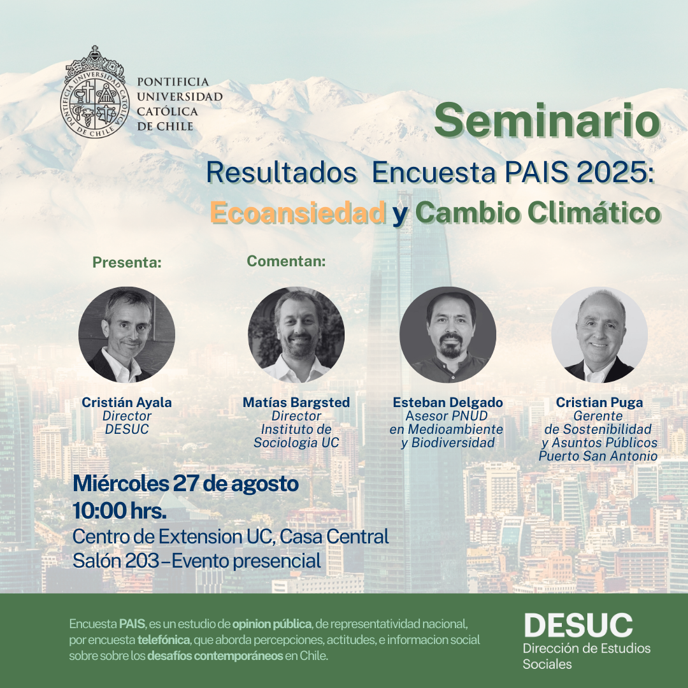

# Bases de Datos – Encuesta PAIS

Encuesta PAIS comenzó el año 2021 como un ejercicio que permitiera indagar en las Percepciones, Actitudes e Información Social de las personas, desde cuestionarios elaborados por el equipo profesional y académico de la Dirección de Estudios Sociales [(DESUC)][desuc], y con ello contribuir a temas de interés. En su primera versión se enfocó en la temática de impuestos y confianza en las encuestas, para en una segunda versión abordar temas de _fake news_.
En esta tercera versión se comenzó con una serie anual que espera abordar las ansiedades contemporáneas, iniciando con la eco–ansiedad, o aquellos temores relacionados al cambio climático y la transición energética.

Este repositorio pone a disposición pública la documentación y bases de datos de Encuesta PAIS. Se espera comenzar desde esta tercera versión compartiendo las bases de datos e insumos asociados.
El **uso de la Base de Datos es abierto y público**. La encuesta es desarrollada y financiada por DESUC. Su Base de Datos, así como los antecedentes metodológicos asociados, se ponen a disposición pública para su uso libre, sin restricciones, siempre que se otorgue la debida atribución institucional. Cualquier persona o institución puede acceder, analizar y reutilizar la información, respetando los estándares éticos de manejo de datos y citando a DESUC como fuente.

En este repositorio encontrarás:

- **Bases de datos** en distintos formatos formatos:
    - .rds (R)
    - .sav (SPSS)
    - .dta (Stata)
- **Libro de códigos**: descripción de variables, valores y etiquetas.
- **Informe metodológico**: antecedentes de la encuesta, construcción del instrumento, información sobre diseño muestral, trabajo de campo, tasas de logro y consideraciones técnicas.
- **Cuestionario** utilizado.
- **Sábana de datos** segmentada por variables de interés.

Los resultados generales de la Encuesta PAIS 2025 fueron presentados en un seminario organizado por DESUC, y puedes encontrar información en esta [nota][resultados], y también una profundización sobre experimentos de [framing][framing].

Cualquier información adicional, puedes escribir a [desuc@uc.cl](mailto:desuc@uc.cl)

[resultados]:https://blog.desuc.cl/posts/2025-09-01-seminario-PAIS/seminario-pais.html
[framing]:https://blog.desuc.cl/posts/2025-09-10-experimento-framing/experimento-framing.html
[desuc]:https://blog.desuc.cl